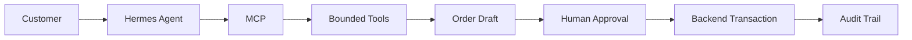

# TuntasUMKM

**AI Agent-assisted order management for UMKM with bounded authority and Human-in-the-Loop transaction approval.**

> Dari Percakapan, Jadi Penjualan.

---

## The Problem

UMKM menerima pesanan dari berbagai channel — WhatsApp, Instagram, Tokopedia. Automation dapat membantu memahami dan menyiapkan pesanan, tetapi keputusan transaksional seperti approval dan perubahan stok membutuhkan kontrol yang jelas.

AI chatbot biasa dapat menghasilkan jawaban, tetapi tidak otomatis berarti AI dapat menjalankan workflow bisnis secara aman. Untuk workflow order UMKM terdapat beberapa tahap:

1. Memahami intent customer
2. Mencari produk
3. Memeriksa data bisnis
4. Membuat draft order
5. Menunggu keputusan pemilik
6. Menjalankan transaction effect
7. Mencatat audit

TuntasUMKM menggunakan AI Agent untuk bagian yang membutuhkan tool use, tetapi mempertahankan human approval pada transaction gate.

---

## Architecture



### Agent Loop

1. Receive user intent
2. Reason about available capabilities
3. Select MCP tool
4. Execute tool
5. Observe result
6. Continue workflow
7. Create bounded order draft
8. Stop at human approval boundary

---

## Bounded Authority

Agent memiliki kewenangan yang dibatasi. Transaction authority tetap berada pada backend + human approval.

| Capability | Agent |
|---|---|
| Search catalog | ✅ |
| Check inventory | ✅ |
| Calculate order total | ✅ |
| Create order draft | ✅ |
| Approve order | ❌ |
| Reject order | ❌ |
| Deduct stock | ❌ |
| Send customer message | ❌ |
| Update order | ❌ |
| Delete order | ❌ |

**Agent tidak memiliki capability langsung untuk melakukan transaksi berisiko tinggi.**

---

## Human-in-the-Loop

Human approval bukan sekadar UI decoration. Approval adalah transaction gate.

```text
Customer intent
  → Agent creates draft
  → Order stops at pending_approval
  → Human reviews confirmation dialog
  → Human approves
  → Backend executes stock deduction
  → Audit trail records actor
```

### Lifecycle

1. **Agent** membuat draft order (status: `pending_approval`)
2. **Human** melihat confirmation dialog dengan detail order dan konsekuensi
3. **Human** melakukan approval melalui dashboard UI
4. **Backend** menjalankan stock deduction
5. **Audit trail** mencatat: agent → human → agent (downstream effects)

---

## MCP Tools

TuntasUMKM menggunakan MCP (Model Context Protocol) sebagai capability boundary. MCP server mengekspos 4 bounded business tools:

| Tool | Type | Description |
|---|---|---|
| `search_catalog` | Read | Search product catalog by name, SKU, or keyword |
| `check_inventory` | Read | Check current stock for a specific product |
| `calculate_order_total` | Read | Calculate total price for a proposed order |
| `create_order_draft` | Write (bounded) | Create pending order draft (no stock deduction, no approval) |

**Important:** Keempat tools tersebut AVAILABLE. Tidak semua tools dipanggil pada setiap workflow. Agent memilih tools yang diperlukan berdasarkan intent.

### Actual Demo Execution

Pada fresh P2.5 execution, agent menggunakan:

1. `search_catalog` — "Sarung Tenun Samarinda"
2. `create_order_draft` — SRG-TNN-04, quantity 1

`check_inventory` dan `calculate_order_total` tidak dipanggil pada run tersebut.

---

## Verified Demo Evidence

### P2.3-R1 (Historical)

| Field | Value |
|---|---|
| Order ID | ORD-20260927-01D05F |
| Product | Sarung Tenun Samarinda |
| SKU | SRG-TNN-04 |
| Quantity | 1 |
| Price | Rp 520.000 |
| Stock before | 5 |
| Stock after | 4 |
| Human approval | YES |
| Audit entries | 4 |

### P2.5 (Fresh Execution)

| Field | Value |
|---|---|
| Order ID | ORD-20260927-35BD8E |
| Product | Sarung Tenun Samarinda |
| SKU | SRG-TNN-04 |
| Quantity | 1 |
| Price | Rp 520.000 |
| Stock before | 3 |
| Stock after | 2 |
| Deduction | 1 |
| Human approval | YES |
| Audit entries | 4 |
| Agent tools used | `search_catalog`, `create_order_draft` |

### Audit Trail (P2.5)

| # | Actor | Action | Before → After |
|---|---|---|---|
| 1 | agent | create_draft | → pending_approval |
| 2 | human | APPROVE_ORDER | pending_approval → approved |
| 3 | agent | DEDUCT_STOCK | reserved → deducted |
| 4 | agent | NOTIFY_CUSTOMER | llm:agnes-2.5-flash → sent |

**Note:** Audit actor menunjukkan downstream backend/system effects setelah human approval. Agent tidak secara langsung melakukan APPROVE_ORDER, DEDUCT_STOCK, atau NOTIFY_CUSTOMER.

---

## Tech Stack

### Frontend

| Technology | Version |
|---|---|
| React | 19.0.0 |
| TypeScript | 4.9.5 |
| Tailwind CSS | 3.4.17 |
| shadcn/ui (Radix UI) | — |
| CRACO | 7.1.0 |
| Axios | 1.18.0 |
| SWR | 2.3.8 |
| React Router DOM | 7.15.0 |
| Recharts | 3.6.0 |
| Framer Motion | 11.18.0 |
| Lucide React | 0.516.0 |
| Zod | 3.24.4 |

### Backend

| Technology | Version |
|---|---|
| FastAPI | 0.110.1 |
| Uvicorn | 0.25.0 |
| SQLite (aiosqlite) | 0.20.0 |
| Pydantic | 2.13.5 |
| python-dotenv | 1.2.3 |
| httpx | 0.28.1 |

### Agent Runtime

| Technology | Version |
|---|---|
| Hermes Agent | 0.21.5 |
| MCP (FastMCP) | 4.0.10 |
| LLM Provider | Bynara router (agnes-2.5-flash) |

---

## API Endpoints

| Method | Endpoint | Description |
|---|---|---|
| GET | `/api/health` | Health check |
| GET | `/api/v1/state` | Dashboard state |
| GET | `/api/v1/inventory` | List inventory |
| GET | `/api/v1/orders` | List orders (filter by status) |
| GET | `/api/v1/orders/{order_id}` | Get order detail |
| GET | `/api/v1/audit-logs` | List audit logs |
| POST | `/api/v1/orders/{order_id}/approve` | Approve order (HITL) |
| POST | `/api/v1/orders/{order_id}/reject` | Reject order (HITL) |
| POST | `/api/v1/webhook/whatsapp` | WhatsApp webhook |
| POST | `/api/v1/demo/reset` | Reset demo data |

---

## Project Structure

```text
TuntasUMKM/
├── backend/
│   ├── server.py           # FastAPI application
│   ├── llm_engine.py       # LLM integration
│   ├── mcp_server.py       # MCP server (4 bounded tools)
│   ├── requirements.txt    # Python dependencies
│   ├── pytest.ini          # Pytest configuration
│   └── tests/              # Backend tests
├── frontend/
│   ├── src/
│   │   ├── components/ui/  # shadcn/ui components
│   │   ├── features/
│   │   │   ├── approval-queue/  # Approval queue feature
│   │   │   └── whatsapp-simulator/  # WhatsApp simulator
│   │   ├── pages/          # Page components
│   │   ├── lib/            # Utilities
│   │   ├── hooks/          # Custom hooks
│   │   └── constants/      # Constants
│   ├── package.json        # Node dependencies
│   └── craco.config.js     # CRACO configuration
├── scripts/
│   └── antislop-check.sh   # Code quality check
├── tests/                  # Integration tests
├── test_reports/           # Test reports
├── memory/                 # Product requirements
├── .cursor/                # Cursor rules
└── README.md
```

---

## Getting Started

### Prerequisites

- Python 3.12+
- Node.js 18+
- Yarn

### Backend

```bash
cd backend
python -m venv .venv
source .venv/bin/activate  # Windows: .venv\Scripts\activate
pip install -r requirements.txt
uvicorn server:app --port 8765
```

### Frontend

```bash
cd frontend
yarn install
yarn start
```

### MCP Server

MCP server berjalan sebagai subprocess yang terhubung ke Hermes Agent. Konfigurasi MCP ada di Hermes config.

---

## Security & Safety Model

### Capability Boundary

Agent hanya mendapatkan tools yang diperlukan.

### Human Transaction Gate

Approval membutuhkan human action.

### No Direct Database Access

Agent tidak diberikan direct database capability.

### Auditability

Workflow menghasilkan audit trail dengan actor distinction.

### Least Privilege

Agent tidak diberi capability transaction berisiko tinggi.

**The architecture is designed around bounded authority, human approval, and auditability.**

---

## Why This Is Different From a Chatbot

| Traditional Chatbot | TuntasUMKM |
|---|---|
| Generates text | Uses business tools |
| Stateless response | Multi-step workflow |
| No transaction boundary | Human transaction gate |
| Limited observability | Audit trail |
| Text output | Business action preparation |

---

## AI HackFest 2026

Project ini dikembangkan dalam konteks AI HackFest 2026 dengan tema:

> "Build Agent, Deliver Impact."

Fokus project:

- AI Agent
- real business workflow
- MCP tool use
- bounded authority
- Human-in-the-Loop
- measurable business effect
- auditability

---

## Demo

[Demo Video — Coming Soon]

---

## Roadmap

### Current

- AI Agent with MCP bounded tools
- Human-in-the-Loop approval via dashboard
- Audit trail with actor separation
- WhatsApp simulator
- AI insight panel
- Progressive disclosure UI
- Approval confirmation dialog

### Potential Next Steps

- Multi-channel order aggregation
- Advanced analytics dashboard
- Integration with external payment gateway
- Mobile-responsive optimization

---

## License

MIT License — Copyright (c) 2026 Shalahuddin Al-Ayyubi
